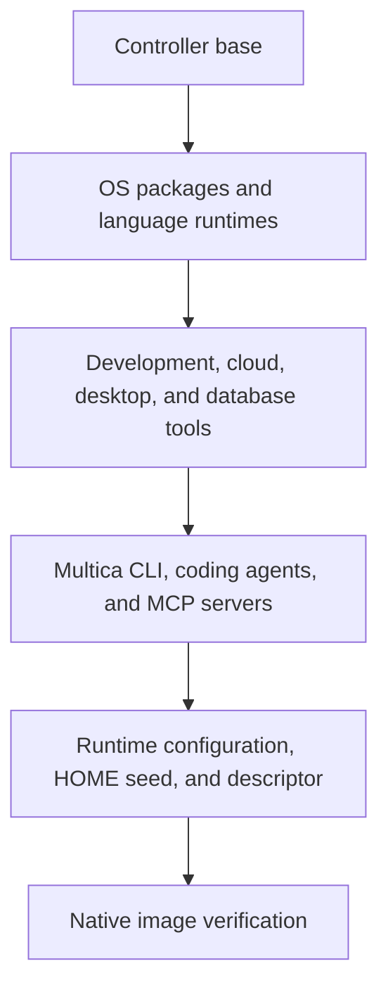

# Multica Runtime

A development container for Multica agents, with language runtimes, coding tools,
cloud and database clients, and a virtual desktop. Published for `linux/amd64` and
`linux/arm64` on GitHub Container Registry.

```sh
docker pull ghcr.io/korioinc/multica-runtime:latest
```

For development testing, use `ghcr.io/korioinc/multica-runtime:develop`.

Use this image with
[Multica Runtime Controller](https://github.com/korioinc/multica-runtime-controller)
to run agents in Kubernetes task-worker Pods.

## Architecture

The image extends the controller's Debian base, which provides the controller
runtime and Go SDK. This repository adds the development environment and its
verified runtime descriptor.



The same image runs in two modes:

- **Controller:** the default command starts the controller runtime.
- **Task worker:** `worker serve` prepares the virtual desktop, then starts the
  worker. The worker remains the container's main process.

The container runs as UID/GID `65532:65532`. Installed tools live under
`/opt/multica/tools` and are read-only. The controller initializes each worker's
writable HOME from the public seed at `/opt/multica/runtime/home-seed`.
[build/layout.json](build/layout.json) defines agent executables, shared tool
paths, environment variables, and the HOME seed. Direct commands, login shells,
and controller-managed commands share the same tool search paths.

The final image includes its descriptor at `/opt/multica/runtime/image.json`.
The controller validates the descriptor against its base and installed binaries
when admitting the image.

## Included Tools

| Area | Tools |
| --- | --- |
| Coding agents | Multica CLI, OpenAI Codex, Pi Coding Agent |
| MCP servers | Codebase Memory MCP, Chrome DevTools MCP |
| Languages | Go, Node.js, Python, PHP, Rust, GCC and G++ |
| Package managers | npm, Corepack, pip, pipx, uv, Composer, Cargo |
| Git and development | Git, Git LFS, git-flow, GitHub CLI, Lefthook, CMake, Ninja, Make |
| Shell and data | Bash, ShellCheck, shfmt, jq, yq, ripgrep, fd, Vim, rsync |
| Kubernetes | kubectl, k9s, kubectx, kubens |
| Cloud | AWS CLI, Google Cloud CLI, Oracle Cloud Infrastructure CLI |
| Database clients | MySQL/MariaDB, PostgreSQL, SQLite, Redis |
| Documents and media | Pandoc, Poppler, ImageMagick, FFmpeg |
| Desktop | Google Chrome, Cua Driver, Xvfb, Openbox, D-Bus, AT-SPI, Mousepad |

PHP includes extensions for internationalization, process control, networking,
MySQL, PostgreSQL, MongoDB, Redis, and compression. Native development headers
cover common TLS, database, image, XML, and compression libraries. Database tools
are clients; database servers are not included.

Pi's preinstalled packages are `pi-mcp-adapter`, `pi-web-access`,
`pi-openai-service-tier`, `@dietrichgebert/ponytail`, and `pi-cache-optimizer`.
The controller seeds them into `~/.pi/agent/npm`, where the worker can use and
manage them without installing the bundled packages on first launch. Codebase
Memory MCP is seeded with automatic indexing enabled.

See [versions.env](versions.env), [build/apt-packages.txt](build/apt-packages.txt),
and [build/desktop-apt-packages.txt](build/desktop-apt-packages.txt) for the build
inputs and OS package lists.

## Running Workers

Configure the controller deployment to use
`ghcr.io/korioinc/multica-runtime:latest` as its runtime image. Worker Pods must
preserve the image entrypoint and pass `args: [worker, serve]` so desktop
initialization runs before the worker starts. Deployment configuration and agent
credentials are supplied by the controller and operator.

Provide writable HOME, workspace, `/tmp`, and controller runtime state mounts
when using a read-only root filesystem. The default HOME is
`/home/multica/agents`. Keep credentials and private configuration in runtime
mounts or secrets; this image and its build inputs are public.

### Virtual desktop

Each worker has an X11 desktop on `DISPLAY=:99`, with a default screen of
`2560x1440x24`. Set `MULTICA_DESKTOP_SCREEN` when creating the container to change
the screen size. Desktop state is private to the worker and stored under
`/tmp/multica-desktop`; screen contents disappear when the container stops.
The desktop uses Unix sockets and does not expose VNC, HTTP, or X11 TCP services.

From a running worker, inspect the display and start browser or native app
automation:

```sh
xdpyinfo -display "$DISPLAY"
google-chrome-stable about:blank &
cua-driver serve
```

Run `cua-driver doctor` from another shell in the same worker to check readiness.
The image installs the tools; the caller supplies its agent skills and MCP client
registrations.

The packaged Chrome launcher adds `--disable-dev-shm-usage` and leaves Chrome's
internal sandbox enabled by default. Both public Chrome commands, packaged
desktop entries, and Chrome DevTools MCP's default stable executable use this
launcher. Use `/usr/bin/google-chrome-stable` when choosing an executable
explicitly. Custom executables, other browser installations, and direct calls to
the internal Chrome binary bypass this configuration; caller arguments are
passed through unchanged.

The matching controller source sets container-level `seccompProfile: Unconfined`
only on task workers. The Pod keeps `RuntimeDefault`, which the HOME init
container inherits. UID/GID 65532, no new privileges, dropped capabilities, and
the read-only root filesystem remain required. This removes the outer seccomp
filter for every process in the worker, including agent commands. Chrome's
internal sandbox does not protect those other processes; the shared host kernel
remains an isolation boundary with a broader syscall attack surface.

Chrome requires usable unprivileged user namespaces and compatible host LSM and
outer-container policies. Kubernetes Pod Security Baseline and Restricted reject
explicit `Unconfined`. There is no automatic `--no-sandbox` retry or extra
privilege fallback. The pinned public controller base in `versions.env` predates
this change: use the modified controller checkout and an explicit local base for
the verification below. A runtime image rebuild alone does not change worker
security settings in an older controller.

Chrome stores its shared-memory files in writable `/tmp`. Keep this mount backed
by disk, as in the controller's worker Pods, and account for its temporary storage,
file cache, and I/O when sizing concurrent workers. Provide a separate
memory-backed Kubernetes volume at `/dev/shm` capped at `512Mi` for other desktop
tools (Docker: `--shm-size=512m`). This is a capacity ceiling, not preallocated or
guaranteed memory: actual tmpfs usage counts toward the worker's unchanged memory
limit alongside its other processes. This cap does not limit Chrome's total
memory usage; Chrome uses `/tmp` from startup, rather than only after `/dev/shm`
fills.

### Project dependencies

Install Python project dependencies in a writable virtual environment:

```sh
python -m venv .venv
. .venv/bin/activate
python -m pip install -r requirements.txt
```

`python` and `python3` use the system Python. `uv venv` and `uv pip install` are
also available. Add `$HOME/.local/bin` to your shell's `PATH` when using tools
installed with pipx or `uv tool install`.

## Building Locally

Requirements: Docker with Buildx, Bash, Git, jq, and `uuidgen`. Build and verify on
a Docker host matching the target architecture.

Validate the public build inputs and choose `linux/amd64` or `linux/arm64` for
your host:

```sh
scripts/inputs.sh check --production
runtime_platform=linux/amd64
scripts/build-image.sh \
  --image multica-runtime:latest \
  --platform "$runtime_platform"
```

The build consumes the controller base image selected in `versions.env`. For a
locally built controller base, pass `--base-image LOCAL_IMAGE`. The build script
produces the final image by default; `--target installed` stops before creating
the runtime descriptor. Run the image verification below before using a local
build.

[versions.env](versions.env) owns pinned tool inputs, and [VERSION](VERSION) owns
the release identifier. Each installation group receives only its own inputs:
OS, languages, general tools, desktop, database clients, and agents. Runtime
configuration and release metadata are added after installation so those changes
preserve installation caches.

BuildKit cache mounts reuse APT packages and downloaded artifacts. The build
script accepts repeatable `--cache-from` and `--cache-to` options. CI maintains
separate registry caches for each architecture and exports intermediate layers.

By default, builds load the image into the local Docker daemon. Pass
`--docker-archive PATH` to export a Docker image archive for a later
`docker load --input PATH`. Release and PR builds export the archive, remove the
job's local BuildKit cache, then load and delete the archive to reduce disk usage
during image loading. Develop builds use `--push-by-digest METADATA_PATH` to
export an untagged OCI manifest, remove local build layers, and pull that exact
digest for native verification. These two output options are mutually exclusive.
The registry caches remain available for subsequent builds.

## Verification

Run source checks with ShellCheck installed:

```sh
shellcheck scripts/*.sh .github/scripts/*.sh
scripts/inputs.sh check --production
scripts/verify-tag-version.sh
scripts/verify-release.sh
```

Verify the locally built image:

```sh
scripts/verify-image.sh --image multica-runtime:latest
```

Verification exercises installed tools, provider integration, controller-managed
HOME initialization, and rejection of image metadata that differs from installed
executables. It uses disposable containers and requires native execution by
default. Controller adapter integration tests remain in the controller repository.

### Local Chrome sandbox verification

The image verifier checks Chrome MCP initialization and tool discovery without
launching Chrome. It does not prove browser behavior or Chrome's sandbox state.
Keep the following separate from `verify-image.sh` and CI. Use a local Unix-socket
Docker engine on the native target architecture; record arm64 and amd64 results
separately. Do not count emulation as native verification.

Build both checkouts together (this example uses a native arm64 engine):

```sh
make -C ../multica-runtime-controller image \
  IMAGE=multica-runtime-controller:chrome-sandbox-local PLATFORM=linux/arm64
scripts/build-image.sh --image multica-runtime:chrome-sandbox-local \
  --base-image multica-runtime-controller:chrome-sandbox-local --platform linux/arm64
scripts/verify-image.sh --image multica-runtime:chrome-sandbox-local
```

In a dedicated Bash shell, prepare an isolated desktop using that exact image ID.
These commands start desktop services and a loopback-only local page server; no
browser is launched. They mount no host HOME or credentials and publish no ports.
The fixture's `/tmp` is tmpfs for disposal, whereas worker `/tmp` is disk-backed;
this fixture proves functionality, not worker storage or memory performance.

```bash
set -euo pipefail
browser_image=$(docker image inspect multica-runtime:chrome-sandbox-local --format '{{.Id}}')
browser_fixture="multica-chrome-check-$(uuidgen | tr '[:upper:]' '[:lower:]')"
cleanup_browser_fixture() { docker rm -f "$browser_fixture" >/dev/null 2>&1 || true; }
trap cleanup_browser_fixture EXIT
trap 'exit 130' INT
trap 'exit 143' TERM
docker run -d --rm --init --name "$browser_fixture" --network none \
  --user 65532:65532 --read-only --cap-drop ALL \
  --security-opt no-new-privileges --security-opt seccomp=unconfined \
  --shm-size=512m \
  --tmpfs '/home/multica/agents:rw,uid=65532,gid=65532,mode=0700' \
  --tmpfs '/tmp:rw,exec,uid=65532,gid=65532,mode=0700' \
  --tmpfs '/run/multica:rw,uid=65532,gid=65532,mode=0700' \
  --tmpfs '/workspace:rw,exec,uid=65532,gid=65532,mode=0700' \
  -e HOME=/tmp/browser-home/agents --entrypoint /bin/bash "$browser_image" -c 'exec sleep infinity'
docker exec -i "$browser_fixture" bash -se <<'FIXTURE'
umask 077
mkdir -m 0700 /tmp/browser-home
/opt/multica/controller/runtime home layout --private-root=/tmp/browser-home
mkdir -p "$XDG_RUNTIME_DIR"
test "$(stat -c %a "$XDG_RUNTIME_DIR")" = 700
touch "$XAUTHORITY"
xauth -f "$XAUTHORITY" add "$DISPLAY" MIT-MAGIC-COOKIE-1 "$(mcookie)"
supervisord -c /etc/multica/desktop-supervisord.conf
printf '<!doctype html><title>Local sandbox fixture</title><p id="result">sandbox-local-ok</p>\n' > /workspace/index.html
python3 -m http.server 8765 --bind 127.0.0.1 --directory /workspace > /tmp/local-page.log 2>&1 &
FIXTURE
docker exec "$browser_fixture" bash -ec '
  for ((attempt=0; attempt<100; attempt++)); do
    if xdpyinfo -display "$DISPLAY" >/dev/null 2>&1 &&
       dbus-send --session --print-reply --reply-timeout=1000 --dest=org.freedesktop.DBus / org.freedesktop.DBus.ListNames >/dev/null 2>&1 &&
       xprop -root _NET_SUPPORTING_WM_CHECK 2>/dev/null | grep -q "window id # 0x" &&
       curl -fsS http://127.0.0.1:8765/ | grep -q sandbox-local-ok; then
      echo "Desktop and local page server ready"; exit 0
    fi
    sleep 0.1
  done
  supervisorctl -c /etc/multica/desktop-supervisord.conf status
  exit 1
'
docker exec "$browser_fixture" bash -ec '
  id
  grep -E "^(Uid|Gid|NoNewPrivs|CapInh|CapPrm|CapEff|CapBnd|CapAmb|Seccomp|Seccomp_filters):" /proc/self/status
  findmnt -T /dev/shm -o TARGET,FSTYPE,SIZE,OPTIONS -b
  test "$(findmnt -n -b -o SIZE -T /dev/shm)" = 536870912
  shm_file=$(mktemp /dev/shm/multica-check.XXXXXX)
  trap '\''rm -f "$shm_file"'\'' EXIT
  printf "shm-write-ok\n" > "$shm_file"
  test "$(cat "$shm_file")" = shm-write-ok
  cua-driver doctor
'
```

The outer diagnostic must show UID/GID 65532, `NoNewPrivs: 1`, all capability
sets zero, `Seccomp: 0`, and a writable 536870912-byte tmpfs. Investigate a
remaining outer filter or LSM restriction before interpreting browser results.
Do not fill `/dev/shm` to its limit or increase worker memory limits to pass.

Perform browser checks with the project's permitted `chrome:control-chrome`
connection (`agent.browsers.get("extension")` and its documented APIs), or have a
person perform them locally. The connection must control this fixture's browser;
an unrelated host Chrome proves nothing about the image. If that connection is
unavailable, agents must leave browser checks unperformed rather than use shell,
MCP, CDP, or CUA browser automation as a substitute. Native app checks may use
CUA: launch Mousepad through the installed driver's documented `launch_app` tool,
then verify the resulting native window's accessibility tree.

For a human's local browser check, enter the fixture with
`docker exec -it "$browser_fixture" bash`. Launch `google-chrome-stable` with a
fresh `--user-data-dir` directory under `/tmp` and open
`http://127.0.0.1:8765/`. Confirm `sandbox-local-ok` from the page. Repeat with
`google-chrome` and verify the packaged desktop entry resolves to the same
launcher. Use a local MCP client inside the fixture to start the bundled
`chrome-devtools-mcp` with its default executable and a fresh isolated profile;
perform an actual new-page and page-read operation against the same local URL.
Initialization or `tools/list` alone is insufficient. Do not pass any sandbox
disabling arguments, use private browser profiles, or contact external sites or
models. Any separately arranged display/debug connection must remain local and
must not expose sockets or ports to external networks.

Use `chrome://sandbox` or equivalent Chrome-owned diagnostics to confirm
namespace isolation and Chrome seccomp-BPF. SUID sandbox disabled can be normal
when the namespace sandbox is active. Correlate diagnostics with browser and
renderer `/proc/<pid>/status`, namespace links under `/proc/<pid>/ns`, and
`/proc/<pid>/cmdline` where readable: a renderer's own filter must be distinguished
from the outer process's `Seccomp: 0`. Process survival alone is insufficient.
Check that the launcher still passes `--disable-dev-shm-usage`, caller arguments
(including an explicit `--` separator), exit status, signals, and file descriptors
through its existing `exec`. Record unavailable diagnostics as gaps.

Record the image ID, architecture, environment, actual commands, page and sandbox
results, and any Chrome stderr before cleanup. User namespace, LSM, or admission
failures remain failures; do not retry with `--no-sandbox`, privileged mode, extra
capabilities, privilege escalation, or weaker host policies. On success, failure,
or interruption, remove the fixture and all of its processes and temporary data:

```bash
docker logs "$browser_fixture"
cleanup_browser_fixture
trap - EXIT INT TERM
```

Run the controller's existing local K3s verification with the same complete image
to prove controller integration. Its generic task checks do not launch Chrome.
Observe its existing held worker before the drift phase to inspect effective
security and `/dev/shm` capacity and small-file writes, using only that harness's
owned cluster and kubeconfig. Separate Docker browser evidence plus generic K3s
evidence does not prove Chrome execution inside an actual K3s worker or
compatibility with production nodes.

Resolved dependency inventories are stored at `/opt/multica/runtime/inventory`,
alongside a copy of the original build inputs. They record installed Debian, npm,
and OCI Python dependencies for inspection. Direct dependency pins do not lock
all transitive dependencies or guarantee byte-identical rebuilds.

## Releases

| Event | Verification and publication |
| --- | --- |
| PR into `develop` | Source, public build inputs, and release automation checks |
| Push to `develop` | Source checks, one native build and execution check per architecture, then publication of `:develop` |
| Same-repository `develop` → `main` PR | Source checks and reuse of the develop commit's `runtime-image` check without another image build |
| Other PR into `main`, including forks | Source checks and native image verification, with read-only permissions |
| Push to `main` with an increased `VERSION` | Creates the immutable version tag and dispatches the release workflow on `main` |

The develop → main PR workflow runs source checks on PRs into `develop` and
`main`, and maintains one promotion PR when develop is ahead of main. Configure
`verify` and `runtime-image` as required checks for `main` so the promotion PR
requires source verification and uses the successful image check from its develop
head commit. The `develop-image-reused` job only explains this reuse; it does not
replace the native verification check. A fork branch named `develop` receives
its own build. Image verification completes before the separate publication step.

Promotion PR creation runs independently of image publication. It uses
`GITHUB_TOKEN`, so GitHub requires a maintainer to approve the resulting PR
workflow runs before their jobs can start. Successful develop verification or
publication does not approve these runs or submit a PR review. See
[GitHub's workflow trigger rules](https://docs.github.com/en/actions/concepts/security/github_token#when-github_token-triggers-workflow-runs).

Develop publication combines the two verified OCI digests without rebuilding.
Only `:develop` moves, and only while the source is still the current develop
head. Serialized runs and recorded run/attempt ownership prevent older runs from
replacing a newer publication. A failed architecture prevents publication.
Develop writes separate `develop-buildcache-amd64` and `develop-buildcache-arm64`
caches and can import the release caches; PR builds only import caches.

Update [VERSION](VERSION) explicitly when preparing a release. Release automation
runs from the selected `main` workflow revision, validates the requested tag and
original commit against main history, and checks out that source separately.
Native release builds retain their own version/revision metadata, candidate
reuse on retry, immutable version tags, and ordered `:latest` promotion. The
workflows do not change VERSION or create release-preparation commits.

To rebuild the current development image manually:

```sh
gh workflow run develop-image.yml --ref develop
```

To retry an existing release, supply its original full commit SHA and run the
workflow on `main`:

```sh
gh workflow run release.yml --ref main \
  -f tag=RELEASE_VERSION -f expected_revision=FULL_ORIGINAL_COMMIT_SHA
```

Creating or pushing a version tag manually no longer starts release publication.
