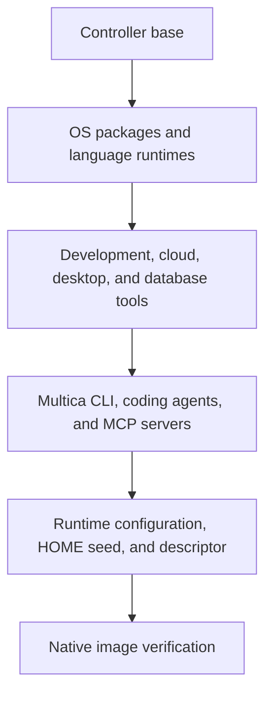

# Multica Runtime

A development container for Multica agents, with language runtimes, coding tools,
cloud and database clients, and a virtual desktop. Published for `linux/amd64` and
`linux/arm64` on GitHub Container Registry.

```sh
docker pull ghcr.io/korioinc/multica-runtime:latest
```

Use this image with
[Multica Runtime Controller](https://github.com/korioinc/multica-runtime-controller)
to run agents in Kubernetes task-worker Pods.

## Architecture

The image extends the controller's Debian base, which provides the controller
runtime and Go SDK. This repository adds the development environment and its
verified runtime descriptor.



The same image runs in two modes:

- **Controller:** the default command starts the controller runtime.
- **Task worker:** `worker serve` prepares the virtual desktop, then starts the
  worker. The worker remains the container's main process.

The container runs as UID/GID `65532:65532`. Installed tools live under
`/opt/multica/tools` and are read-only. The controller initializes each worker's
writable HOME from the public seed at `/opt/multica/runtime/home-seed`.
[build/layout.json](build/layout.json) defines agent executables, shared tool
paths, environment variables, and the HOME seed. Direct commands, login shells,
and controller-managed commands share the same tool search paths.

The final image includes its descriptor at `/opt/multica/runtime/image.json`.
The controller validates the descriptor against its base and installed binaries
when admitting the image.

## Included Tools

| Area | Tools |
| --- | --- |
| Coding agents | Multica CLI, OpenAI Codex, Pi Coding Agent |
| MCP servers | Codebase Memory MCP, Chrome DevTools MCP |
| Languages | Go, Node.js, Python, PHP, Rust, GCC and G++ |
| Package managers | npm, Corepack, pip, pipx, uv, Composer, Cargo |
| Git and development | Git, Git LFS, git-flow, GitHub CLI, Lefthook, CMake, Ninja, Make |
| Shell and data | Bash, ShellCheck, shfmt, jq, yq, ripgrep, fd, Vim, rsync |
| Kubernetes | kubectl, k9s, kubectx, kubens |
| Cloud | AWS CLI, Google Cloud CLI, Oracle Cloud Infrastructure CLI |
| Database clients | MySQL/MariaDB, PostgreSQL, SQLite, Redis |
| Documents and media | Pandoc, Poppler, ImageMagick, FFmpeg |
| Desktop | Google Chrome, Cua Driver, Xvfb, Openbox, D-Bus, AT-SPI, Mousepad |

PHP includes extensions for internationalization, process control, networking,
MySQL, PostgreSQL, MongoDB, Redis, and compression. Native development headers
cover common TLS, database, image, XML, and compression libraries. Database tools
are clients; database servers are not included.

Pi's preinstalled packages are `pi-mcp-adapter`, `pi-web-access`,
`pi-openai-service-tier`, `@dietrichgebert/ponytail`, and `pi-cache-optimizer`.
The controller seeds them into `~/.pi/agent/npm`, where the worker can use and
manage them without installing the bundled packages on first launch. Codebase
Memory MCP is seeded with automatic indexing enabled.

See [versions.env](versions.env), [build/apt-packages.txt](build/apt-packages.txt),
and [build/desktop-apt-packages.txt](build/desktop-apt-packages.txt) for the build
inputs and OS package lists.

## Running Workers

Configure the controller deployment to use
`ghcr.io/korioinc/multica-runtime:latest` as its runtime image. Worker Pods must
preserve the image entrypoint and pass `args: [worker, serve]` so desktop
initialization runs before the worker starts. Deployment configuration and agent
credentials are supplied by the controller and operator.

Provide writable HOME, workspace, `/tmp`, and controller runtime state mounts
when using a read-only root filesystem. The default HOME is
`/home/multica/agents`. Keep credentials and private configuration in runtime
mounts or secrets; this image and its build inputs are public.

### Virtual desktop

Each worker has an X11 desktop on `DISPLAY=:99`, with a default screen of
`2560x1440x24`. Set `MULTICA_DESKTOP_SCREEN` when creating the container to change
the screen size. Desktop state is private to the worker and stored under
`/tmp/multica-desktop`; screen contents disappear when the container stops.
The desktop uses Unix sockets and does not expose VNC, HTTP, or X11 TCP services.

From a running worker, inspect the display and start browser or native app
automation:

```sh
xdpyinfo -display "$DISPLAY"
google-chrome-stable about:blank &
cua-driver serve
```

Run `cua-driver doctor` from another shell in the same worker to check readiness.
The image installs the tools; the caller supplies its agent skills and MCP client
registrations.

The packaged Chrome launcher adds `--no-sandbox` and `--disable-dev-shm-usage`.
The former disables Chrome's internal process sandbox, so browser sessions share
the task user's access to files and credentials. Use
`/usr/bin/google-chrome-stable` when choosing an executable explicitly.

Chrome stores its shared-memory files in writable `/tmp`. Keep this mount backed
by disk, as in the controller's worker Pods, and account for its temporary storage,
file cache, and I/O when sizing concurrent workers. Provide a separate
memory-backed Kubernetes volume at `/dev/shm` capped at `256Mi` for other desktop
tools (Docker: `--shm-size=256m`). This cap does not limit Chrome's total memory
usage; Chrome uses `/tmp` from startup, rather than only after `/dev/shm` fills.

### Project dependencies

Install Python project dependencies in a writable virtual environment:

```sh
python -m venv .venv
. .venv/bin/activate
python -m pip install -r requirements.txt
```

`python` and `python3` use the system Python. `uv venv` and `uv pip install` are
also available. Add `$HOME/.local/bin` to your shell's `PATH` when using tools
installed with pipx or `uv tool install`.

## Building Locally

Requirements: Docker with Buildx, Bash, Git, jq, and `uuidgen`. Build and verify on
a Docker host matching the target architecture.

Validate the public build inputs and choose `linux/amd64` or `linux/arm64` for
your host:

```sh
scripts/inputs.sh check --production
runtime_platform=linux/amd64
scripts/build-image.sh \
  --image multica-runtime:latest \
  --platform "$runtime_platform"
```

The build consumes the controller base image selected in `versions.env`. For a
locally built controller base, pass `--base-image LOCAL_IMAGE`. The build script
produces the final image by default; `--target installed` stops before creating
the runtime descriptor. Run the image verification below before using a local
build.

[versions.env](versions.env) owns pinned tool inputs, and [VERSION](VERSION) owns
the release identifier. Each installation group receives only its own inputs:
OS, languages, general tools, desktop, database clients, and agents. Runtime
configuration and release metadata are added after installation so those changes
preserve installation caches.

BuildKit cache mounts reuse APT packages and downloaded artifacts. The build
script accepts repeatable `--cache-from` and `--cache-to` options. CI maintains
separate registry caches for each architecture and exports intermediate layers.

## Verification

Run source checks with ShellCheck installed:

```sh
shellcheck scripts/*.sh .github/scripts/*.sh
scripts/inputs.sh check --production
scripts/verify-tag-version.sh
scripts/verify-release.sh
```

Verify the locally built image:

```sh
scripts/verify-image.sh --image multica-runtime:latest
```

Verification exercises installed tools, provider integration, controller-managed
HOME initialization, and rejection of image metadata that differs from installed
executables. It uses disposable containers and requires native execution by
default. Controller adapter integration tests remain in the controller repository.

Resolved dependency inventories are stored at `/opt/multica/runtime/inventory`,
alongside a copy of the original build inputs. They record installed Debian, npm,
and OCI Python dependencies for inspection. Direct dependency pins do not lock
all transitive dependencies or guarantee byte-identical rebuilds.

## Releases

Update [VERSION](VERSION) explicitly when preparing a release. The develop → main
PR workflow maintains one promotion PR. The separate Runtime PR CI workflow runs
source and native image checks on pull requests targeting develop or main, keeping
`verify` and `runtime-image` as the required checks. When GitHub Actions creates a
new promotion PR, a maintainer must select **Approve workflows to run** on that PR
to start its first CI run. Later developer pushes trigger CI through the PR event.
The workflows do not change VERSION or create release-preparation commits.
