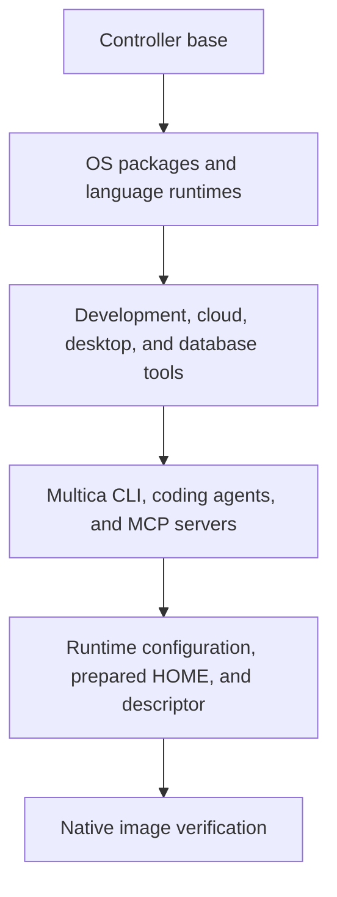

# Multica Runtime

A development container for Multica agents, with language runtimes, coding tools,
cloud and database clients, and a virtual desktop. Published for `linux/amd64` and
`linux/arm64` on GitHub Container Registry.

```sh
docker pull ghcr.io/korioinc/multica-runtime:latest
```

For development testing, use `ghcr.io/korioinc/multica-runtime:develop`.

Use this image with
[Multica Runtime Controller](https://github.com/korioinc/multica-runtime-controller)
to run agents in Kubernetes task-worker Pods.

## Architecture

The image extends the controller's Debian base, which provides the controller
runtime and Go SDK. This repository adds the development environment and its
verified runtime descriptor.


```mermaid
flowchart TD
    base[Controller base] --> languages[OS packages and language runtimes]
    languages --> tools[Development, cloud, desktop, and database tools]
    tools --> agents[Multica CLI, coding agents, and MCP servers]
    agents --> final[Runtime configuration, prepared HOME, and descriptor]
    final --> verification[Native image verification]
```

The same image runs in two modes:

- **Controller:** the default command starts `runtime init controller` as PID 1.
  The same binary starts the controller child and reaps adopted processes.
- **Task worker:** `worker serve` becomes PID 1, verifies its bootstrap and
  prepares HOME. After execution admission, it configures package managers and
  a conversation-owned desktop, then starts the provider and supervises its child processes.
  The resident desktop starts below `runtime init worker desktop`. Each SDK runner starts below `runtime init worker run`. The signing worker
  retains result authentication, writer fencing, and storage cleanup.

Both paths use the controller binary's internal init implementation. Tini is
absent from the base and complete candidate images. Desktop Supervisor remains
responsible for X11, D-Bus, Openbox, and Cua Driver services.

The container runs as UID/GID `65532:65532`. Installed tools live under
`/opt/multica/tools` and are read-only. Public defaults and Pi packages are
installed directly in `/home/multica/agents` during the image build. Each
container uses that HOME through its private writable layer; worker startup
applies current configuration without copying bundled packages.
[build/layout.json](build/layout.json) defines agent executables, shared tool
paths, and environment variables. Direct commands, login shells,
and controller-managed commands share the same tool search paths.

The final image includes its descriptor at `/opt/multica/runtime/image.json`.
The controller validates the descriptor against its base and installed binaries
when admitting the image. Build identity, platform and binary hashes bind the
controller and runtime contents together.

## Included Tools

| Area | Tools |
| --- | --- |
| Coding agents | Multica CLI, OpenAI Codex, Claude Code, Pi Coding Agent |
| MCP servers | Codebase Memory MCP |
| Languages | Go, Node.js, Python, PHP, Rust, GCC and G++ |
| Package managers | npm, Corepack, pip, pipx, uv, Composer, Cargo |
| Git and development | Git, Git LFS, git-flow, GitHub CLI, Lefthook, CMake, Ninja, Make |
| Shell and data | Bash, ShellCheck, shfmt, jq, yq, ripgrep, fd, Vim, rsync |
| Kubernetes | kubectl, k9s, kubectx, kubens |
| Cloud | AWS CLI, Google Cloud CLI, Oracle Cloud Infrastructure CLI |
| Database clients | MySQL/MariaDB, PostgreSQL, SQLite, Redis |
| Documents and media | Pandoc, Poppler, ImageMagick, FFmpeg |
| Desktop | Google Chrome, Xvfb, Openbox, D-Bus, AT-SPI, Mousepad |
| Browser and desktop automation | Open Browser Use (`obu`), Cua Driver (`cua-driver`) |

PHP includes extensions for internationalization, process control, networking,
MySQL, PostgreSQL, MongoDB, Redis, and compression. Native development headers
cover common TLS, database, image, XML, and compression libraries. Database tools
are clients; database servers are not included.

Pi's preinstalled packages are `pi-mcp-adapter`, `pi-web-access`,
`pi-openai-service-tier`, `@dietrichgebert/ponytail`, and `pi-cache-optimizer`.
They are installed in `~/.pi/agent/npm`, where the worker can use and manage them
without installing the bundled packages on first launch. Codebase Memory MCP
creates its own configuration and index databases at its default locations when
used; the image does not precreate a database or override its settings.

Claude Code is installed globally with npm as `@anthropic-ai/claude-code`, using
`/opt/multica/tools` as the installation prefix. Its launcher is
`/opt/multica/tools/bin/claude`. `CLAUDE_VERSION` in [versions.env](versions.env)
pins the package and its platform dependency. The package's postinstall step links
the executable, and automatic updates are disabled with `DISABLE_AUTOUPDATER=1`.
Change the pin and rebuild the image to update it.

The controller registers the providers declared in [build/layout.json](build/layout.json).
Image finalization records their installed paths, pinned versions, and binary hashes
in `/opt/multica/runtime/image.json`. The inventory includes Claude Code, Codex, and Pi.

See [versions.env](versions.env), [build/apt-packages.txt](build/apt-packages.txt),
and [build/desktop-apt-packages.txt](build/desktop-apt-packages.txt) for the build
inputs and OS package lists.

## Running Workers

Configure the controller deployment to use
`ghcr.io/korioinc/multica-runtime:latest` as its runtime image. Worker Pods must
preserve the image entrypoint and pass `args: [worker, serve]` so desktop
initialization runs after execution admission and before the agent starts.
Deployment configuration and agent credentials are supplied by the controller
and operator.

Keep the container root filesystem writable and leave `/home/multica/agents`
unmounted so its packaged files remain available. Mount workspace, `/tmp`, and
controller runtime state separately. Container replacement restores the image's
public HOME defaults; task work and provider sessions remain on workspace
storage. Supply credentials and private configuration at runtime; this image
and its build inputs are public.

### Package proxy

`PACKAGE_PROXY_URL` is the base URL of the package proxy reachable from worker
Pods. During worker startup, it configures npm, Cargo, pip, and Composer to
download packages through that proxy. The proxy must serve the package endpoints
listed below.

For example, set
`PACKAGE_PROXY_URL=http://multica-runtime-controller-packages.multica.svc.cluster.local:8081`
to use `http://multica-runtime-controller-packages.multica.svc.cluster.local:8081/npm/`
for npm. Supply only the base URL; the worker appends each tool's path
automatically. The URL must start with `http://` or
`https://` and contain no whitespace, query string, or fragment. An invalid value
causes worker setup to fail before the provider starts.

Supply `PACKAGE_PROXY_URL` through the controller's operator environment to
configure package downloads in new workers. A key in a Kubernetes Secret must
be explicitly selected by the deployment. With the controller Helm chart:

```yaml
packageProxy:
  enabled: true
  allowWorkerAccess: true
operator:
  env:
    - name: PACKAGE_PROXY_URL
      valueFrom:
        secretKeyRef:
          name: multica-env
          key: PACKAGE_PROXY_URL
          optional: true
```

The chart adds the `MULTICA_OPERATOR_` prefix and opens worker access to the
enabled proxy on TCP 8081. For the default release in namespace `multica`, use
`http://multica-runtime-controller-packages.multica.svc.cluster.local:8081` as
the Secret value. The gateway Service `multica-runtime-controller-gateway` serves TCP
8080; package downloads use the separate `multica-runtime-controller-packages`
Service.

With `<base>` denoting the URL after trailing slashes are removed, workers apply:

| Tool | User setting |
| --- | --- |
| npm | `registry=<base>/npm/` in `~/.npmrc` |
| Cargo | crates.io replacement `proxy` with `registry="sparse+<base>/cargo/"` in `~/.cargo/config.toml` |
| pip | `global.index-url=<base>/pypi/simple/` in the user pip configuration |
| Composer | A global Composer repository with URL `<base>/composer`; the repository collection may be an object or an array. |

Trailing slashes are removed before adding these paths. Unset or empty values
leave package configuration untouched. Existing unrelated settings are preserved;
Cargo's legacy `~/.cargo/config` is updated instead when present.

If another deployment injects plain `PACKAGE_PROXY_URL` into the controller
process, the entrypoint forwards it as `MULTICA_OPERATOR_PACKAGE_PROXY_URL`.
An explicitly set prefixed value takes precedence. The controller captures
operator values at startup and sends them in each task's bootstrap. The worker
passes the merged environment to task package setup and the provider; task environment
settings retain their normal precedence. A separate `kubectl exec ... env`
process does not inherit that provider environment. Verify the value through a
command executed by the agent.

Roll out the controller after changing the Secret. Newly prepared workers receive
the updated value; existing task bootstraps keep their captured environment.
No proxy address is stored in the public image.

For HTTP endpoints, pip also trusts the proxy's host and port, and Composer's
global `secure-http` setting is disabled so it can access HTTP repositories.
HTTPS endpoints do not change these settings or disable TLS verification.

### Virtual desktop

Each worker has an X11 desktop on `DISPLAY=:99`, with a default screen of
`2560x1440x24`. Set `MULTICA_DESKTOP_SCREEN` when creating the container to change
the screen size. Resident desktop state uses the worker's private
`/run/multica/desktop` volume paths; legacy non-session execution uses
`/tmp/multica-desktop`. In-memory windows disappear when the container stops.
The desktop uses Unix sockets and does not expose VNC, HTTP, or X11 TCP services.

The first authorized turn prepares the display and starts a supervised Cua Driver daemon.
It waits for X11, D-Bus, Openbox and a successful Cua CLI request before starting
the provider. Later compatible turns check the same resident owner and retain browser windows and opened applications. Start Chrome only when a task needs a browser; its prepared Default
profile is selected automatically:

```sh
xdpyinfo -display "$DISPLAY"
google-chrome-stable &
```

Open Browser Use and [Cua Driver](https://cua.ai/docs/how-to-guides/driver/install)
are pinned by `OPEN_BROWSER_USE_VERSION` and `CUA_DRIVER_VERSION` in
[versions.env](versions.env). Both provide a CLI and a stdio MCP server
(`obu mcp` and `cua-driver mcp`); this image does not register MCP servers.
Cua CLI commands connect directly to the supervised daemon without MCP setup.
Cua Driver uses the official versioned Linux release for each architecture,
including its cursor-theme companion. Telemetry and update checks are disabled;
change the version pin and rebuild the image to update it.
The supervised daemon uses `--no-overlay`: without a compositor, its cursor
overlay can appear as an opaque shape in screenshots.

The image configuration step runs `open-browser-use setup --no-open --browser chrome`
to register the native host and request installation of the
[Open Browser Use extension](https://chromewebstore.google.com/detail/open-browser-use/bgjoihaepiejlfjinojjfgokghnodnhd).
Chrome then installs the extension from the Web Store during the build. This step
requires network access and follows normal Docker layer caching. Chrome handles
Store updates through its built-in updater. The extension is intentionally
unpinned; only the two CLI versions are managed in `versions.env`. The generated
native host manifest is installed globally with the pinned CLI executable path,
so workers do not need to run setup again. Agent skill updates are excluded.

The image build initializes `~/.config/google-chrome/Default` and checks the
extension connection before retaining the prepared profile. Only extension files
and their installation settings are retained; browser identifiers, keys, cookies,
history, sessions, and extension storage are generated independently in each worker.
The original image-time Python initialization remains unchanged. Resident Chrome uses the existing `/home/multica/agents/.config/google-chrome` directory through its own `XDG_CONFIG_HOME`. No additional profile seed is copied. Later compatible turns retain the same browser process, profile, windows, and tabs. Cua and other desktop applications keep their neutral HOME. The root-owned Chrome launcher routes authenticated session launches through that resident owner; exactly `--version` still uses the preserved original launcher directly. Legacy non-session tasks retain their own launch domain. Malformed bootstrap and resident-owner loss refuse application launch. Chrome is closed in the resulting image. `obu` detects the installed extension
before Chrome starts; connectivity becomes available when a task launches Chrome,
including without network access. No `--user-data-dir` or `--profile-directory`
arguments are needed. Additional Chrome profiles install the extension from the
Web Store and require network access for their first installation.

After starting Chrome, check browser connectivity. Cua is already running in
each worker and uses the same XDG paths as the agent for default CLI discovery:

```sh
obu ping --session-id desktop-check
cua-driver status
cua-driver doctor
cua-driver call list_apps '{}'
```

Supervisord restarts the daemon if it exits; final worker shutdown terminates it
with the other desktop processes. Agent tasks use the existing daemon and retain
windows and application state for compatible follow-ups. Explicit application
close or quit remains effective. Logs are in
`$XDG_RUNTIME_DIR/cua-driver.log`.

Cua Driver uses X11 and AT-SPI directly, without a Python accessibility bridge.
If a keyboard action reports `background_unavailable`, retry it with
`delivery_mode: "foreground"` inside the worker's virtual desktop.
The image and worker environment set `ACCESSIBILITY_ENABLED=1` to enable Chrome's
Linux accessibility connection by default.

The packaged Chrome launcher adds `--disable-dev-shm-usage` and `--no-first-run`.
Skipping the first-run dialog lets new profiles initialize and install the bundled
extension without waiting for interactive setup. Chrome's internal sandbox remains
enabled by default. Public Chrome commands and packaged desktop entries use this
launcher. Use `/usr/bin/google-chrome-stable` when choosing an executable
explicitly. Custom executables, other browser installations, and direct calls to
the internal Chrome binary bypass this configuration; caller arguments are
passed through unchanged.

The matching controller source sets container-level `seccompProfile: Unconfined`
only on task workers. The Pod keeps `RuntimeDefault`, which the task layout init
container inherits. UID/GID 65532, no new privileges, dropped capabilities, and
private writable container storage remain required. This removes the outer seccomp
filter for every process in the worker, including agent commands. Chrome's
internal sandbox does not protect those other processes; the shared host kernel
remains an isolation boundary with a broader syscall attack surface.

Chrome requires usable unprivileged user namespaces and compatible host LSM and
outer-container policies. Kubernetes Pod Security Baseline and Restricted reject
explicit `Unconfined`. There is no automatic `--no-sandbox` retry or extra
privilege fallback. The controller base pinned in `versions.env` includes these
worker security settings. Rebuild the runtime against a matching controller base
when changing controller metadata or worker policy.

Chrome stores its shared-memory files in writable `/tmp`. Keep this mount backed
by disk, as in the controller's worker Pods, and account for its temporary storage,
file cache, and I/O when sizing concurrent workers. Provide a separate
memory-backed Kubernetes volume at `/dev/shm` capped at `512Mi` for other desktop
tools (Docker: `--shm-size=512m`). This is a capacity ceiling, not preallocated or
guaranteed memory: actual tmpfs usage counts toward the worker's unchanged memory
limit alongside its other processes. This cap does not limit Chrome's total
memory usage; Chrome uses `/tmp` from startup, rather than only after `/dev/shm`
fills.

### Project dependencies

Install Python project dependencies in a writable virtual environment:

```sh
python -m venv .venv
. .venv/bin/activate
python -m pip install -r requirements.txt
```

`python`, `python3`, `pip`, and `pip3` use the Python release selected by
`PYTHON_VERSION` in [versions.env](versions.env). Python is built from its official
source release; `PIPX_VERSION` selects pipx installed in a separate virtual
environment using that Python. Change these values and rebuild to install other
compatible releases, including versions outside the Debian snapshot. Debian's
`/usr/bin/python3` remains available for OS tools and the cloud CLIs.
`uv venv` and `uv pip install` are also available. Add `$HOME/.local/bin` to your
shell's `PATH` when using tools installed with pipx or `uv tool install`.

## Building Locally

Requirements: Docker with Buildx, Bash, Git, jq, and `uuidgen`. Build and verify on
a Docker host matching the target architecture.

Choose `linux/amd64` or `linux/arm64` for your host. In the matching controller
checkout, build `multica-runtime-controller:local` with
`make image IMAGE=multica-runtime-controller:local PLATFORM=linux/amd64` (adjust
the platform for your host). Then validate the public inputs and build this runtime:

```sh
scripts/inputs.sh check --production
runtime_platform=linux/amd64
scripts/build-image.sh \
  --image multica-runtime:latest \
  --base-image multica-runtime-controller:local \
  --platform "$runtime_platform"
```

`MULTICA_CLI_VERSION` selects the installed CLI independently of the controller.
The controller reports that installed version without a release allowlist;
incompatible helper or API behavior fails during preparation or execution.

The build script produces the final image by default; `--target installed` stops
before creating the runtime descriptor. Run the image verification below before
using a local build.

[versions.env](versions.env) owns pinned tool inputs, and [VERSION](VERSION) owns
the release identifier. Each installation group receives only its own inputs:
OS, languages, general tools, desktop, database clients, and agents. Runtime
configuration and release metadata are added after installation so those changes
preserve installation caches.

APT prefers the configured Debian snapshot even when the controller base contains
newer packages, so runtime and development libraries resolve to matching versions.

BuildKit cache mounts reuse APT packages and downloaded artifacts. The build
script accepts repeatable `--cache-from` and `--cache-to` options. CI maintains
separate registry caches for each architecture and exports intermediate layers.

By default, builds load the image into the local Docker daemon. Pass
`--docker-archive PATH` to export a Docker image archive for a later
`docker load --input PATH`. Release and PR builds export the archive, remove the
job's local BuildKit cache, then load and delete the archive to reduce disk usage
during image loading. Develop builds use `--push-by-digest METADATA_PATH` to
export an untagged OCI manifest, remove local build layers, and pull that exact
digest for native verification. These two output options are mutually exclusive.
The registry caches remain available for subsequent builds.

## Verification

Run source checks with ShellCheck installed:

```sh
shellcheck scripts/*.sh .github/scripts/*.sh
scripts/inputs.sh check --production
scripts/verify-tag-version.sh
scripts/verify-release.sh
```

Verify the locally built image:

```sh
scripts/verify-image.sh --image multica-runtime:latest
```

Image verification checks that no Tini package, standard executable, or PATH
command remains. It also exercises controller admission and rejection of a
changed daemon binary or mismatched descriptor checksum. It uses disposable
containers and requires native execution by default. These checks do not prove
PID 1 supervision, provider behavior, or browser behavior. Run the controller
repository's separate native lifecycle checks on the target architecture.

For desktop diagnosis, use a running worker's `xdpyinfo -display "$DISPLAY"` and
Chrome's own `chrome://sandbox` diagnostics. Browser and controller integration depend on
the worker's host and security settings; image admission alone does not establish
them.

Resolved dependency inventories are stored at `/opt/multica/runtime/inventory`,
alongside a copy of the original build inputs. They record installed Debian, npm,
and OCI Python dependencies for inspection. Direct dependency pins do not lock
all transitive dependencies or guarantee byte-identical rebuilds.

## Releases

| Event | Verification and publication |
| --- | --- |
| PR into `develop` | Source, public build inputs, and release automation checks |
| Push to `develop` | Source checks, one native build and execution check per architecture, then publication of `:develop` |
| Same-repository `develop` → `main` PR | Source checks and reuse of the develop commit's `runtime-image` check without another image build |
| Other PR into `main`, including forks | Source checks and native image verification, with read-only permissions |
| Push to `main` with an increased `VERSION` | Creates the immutable version tag and dispatches the release workflow on `main` |

The develop → main PR workflow runs source checks on PRs into `develop` and
`main`, and maintains one promotion PR when develop is ahead of main. Configure
`verify` and `runtime-image` as required checks for `main` so the promotion PR
requires source verification and uses the successful image check from its develop
head commit. The `develop-image-reused` job only explains this reuse; it does not
replace the native verification check. A fork branch named `develop` receives
its own build. Image verification completes before the separate publication step.

Promotion PR creation runs independently of image publication. It uses
`GITHUB_TOKEN`, so GitHub requires a maintainer to approve the resulting PR
workflow runs before their jobs can start. Successful develop verification or
publication does not approve these runs or submit a PR review. See
[GitHub's workflow trigger rules](https://docs.github.com/en/actions/concepts/security/github_token#when-github_token-triggers-workflow-runs).

Develop publication combines the two verified OCI digests without rebuilding.
Only `:develop` moves, and only while the source is still the current develop
head. Serialized runs and recorded run/attempt ownership prevent older runs from
replacing a newer publication. A failed architecture prevents publication.
Develop writes separate `develop-buildcache-amd64` and `develop-buildcache-arm64`
caches and can import the release caches; PR builds only import caches.

Update [VERSION](VERSION) explicitly when preparing a release. Release automation
runs from the selected `main` workflow revision, validates the requested tag and
original commit against main history, and checks out that source separately.
Native release builds retain their own version/revision metadata, candidate
reuse on retry, immutable version tags, and ordered `:latest` promotion. The
workflows do not change VERSION or create release-preparation commits.

To rebuild the current development image manually:

```sh
gh workflow run develop-image.yml --ref develop
```

To retry an existing release, supply its original full commit SHA and run the
workflow on `main`:

```sh
gh workflow run release.yml --ref main \
  -f tag=RELEASE_VERSION -f expected_revision=FULL_ORIGINAL_COMMIT_SHA
```

Creating or pushing a version tag manually no longer starts release publication.
